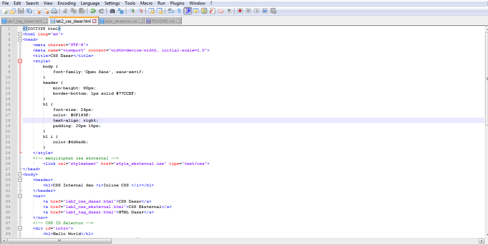
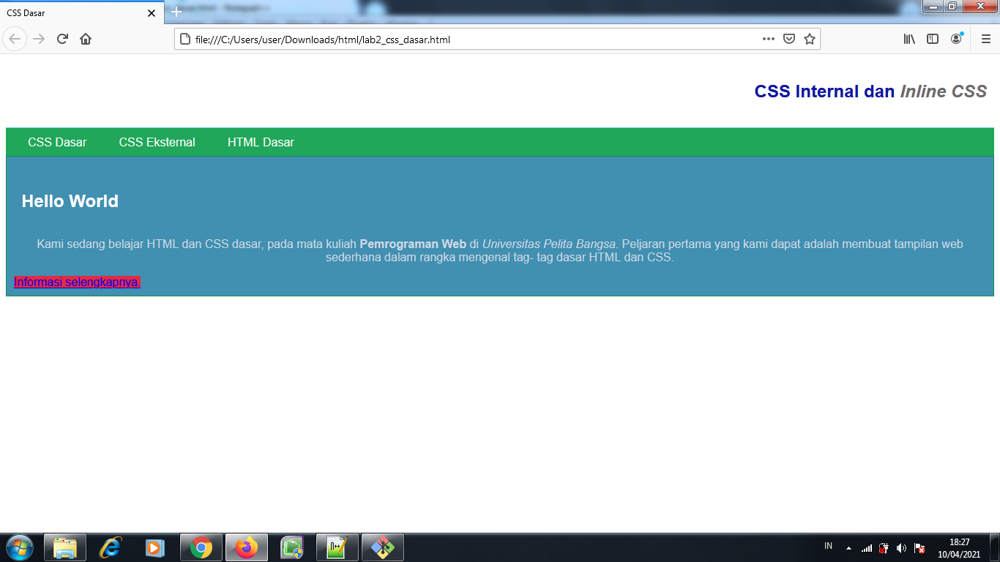
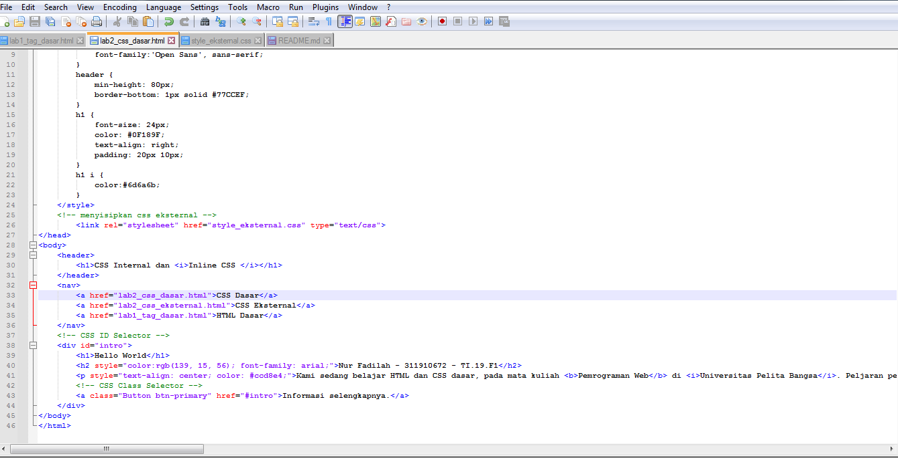
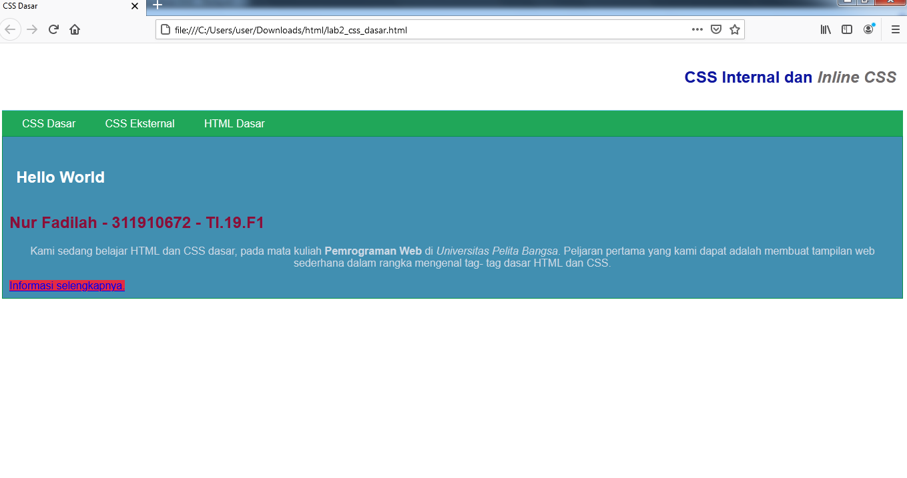

# Praktik2
## Belajar HTML dan CSS

##### Nama : Nur Fadilah
##### NIM : 311910672

### Menjawab Pertanyaan Tugas Praktikum 2
#####1 Lakukan eksperimen dengan mengubah dan menambah properti dan nilai pada kode CSS dengan mengacu pada CSS Cheat Sheet yang diberikan pada file terpisah dari modul ini.
Jawaban :

#####2 Apa perbedaan pendeklarasian CSS elemen h1 {...} dengan #intro h1 {...}? berikan penjelasannya!
Jawaban : Perbedaan antara id dan class adalah ID hanya bisa digunakan untuk satu objek saja, diawali dengan tanda pagar (#). Class adalah style dari CSS yang bisa digunakan untuk beberapa elemen, dengan adanya class ini memungkinkan anda untuk merubah beberapa objek pada html dengan settingan yang sama.

#####3 Apabila ada deklarasi CSS secara internal, lalu ditambahkan CSS eksternal dan inline CSS pada elemen yang sama. Deklarasi yang manakah yang akan ditampilkan pada browser? berikan penjelasan dan contohnya!
Jawaban : Semua deklarasi akan ditampilkan, karena saling melengkapi, berikut contohnya:

#####4 Pada sebuah elemen HTML terdapat ID dan Class, apabila masing-masing selector tersebut terdapat deklarasi CSS, maka deklarasi manakah yang akan ditampilkan pada browser? Berikan penjelasan dan contohnya! ( 
 )
Jawaban :
